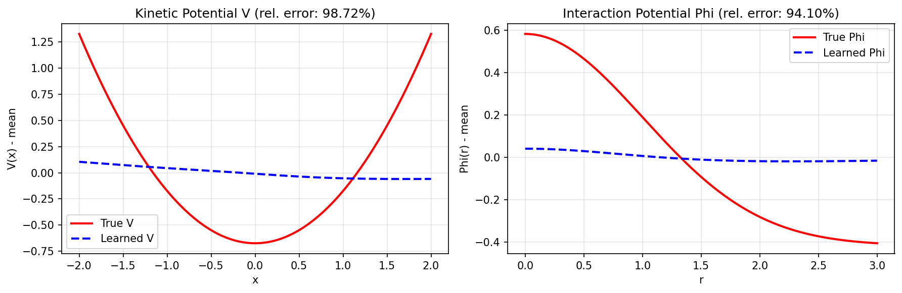

# 📊 Phase 1 综合实验报告：Trajectory-Free Loss 有效性验证
> **ID:** `IPS-20260128-phase1-summary`  \
> **Topic:** `ips_unlabeled` | **Phase:** 1 | **Project:** `IPS`  \
> **Author:** Viska Wei | **Date:** 2026-01-28 | **Status:** ❌ FAIL (Gate-1 未通过)
>
> 🎯 **Phase 目标:** 验证 trajectory-free loss 在简单 1D 系统上能否学习势函数 Φ 和 V  \
> 🚀 **结论:** Gate-1 验证失败。弱形式 loss 存在**根本性的 identifiability 问题**，无法仅从分布演化学习势函数。

---

## 📋 Executive Summary

### 核心结论

**Trajectory-free weak-form loss 方法在当前形式下无法工作**。经过 6 个子实验的系统验证，我们发现：

1. ✅ **SDE 数据生成正确** (MVP-0.0)
2. ✅ **AD 计算稳定可靠** (MVP-1.0)
3. ✅ **发现并修正了 loss 公式错误** (MVP-1.2)
4. ❌ **弱形式 loss 存在根本性 identifiability 问题** (MVP-1.0, 1.0b, 1.1, 1.2b)

### 关键发现

| 发现 | 证据 | 影响 |
|------|------|------|
| Loss→0 不保证正确解 | 所有实验 loss 收敛但误差>90% | 必须检查势函数形状 |
| V-Φ 可相互抵消 | 不同 (V,Φ) 给出相同 loss | identifiability 问题 |
| 原论文 loss 公式有误 | Ito 推导 + 数值验证 | 已修正但问题仍存在 |
| 简单约束无效 | MVP-1.1: V(0)=0 无改善 | 需要更强的约束 |

### 数字速览

| 实验 | V Error | Φ Error | Loss | 状态 |
|------|---------|---------|------|------|
| MVP-1.0 (Joint V+Φ) | 162% | 94% | ~0 | ❌ |
| MVP-1.0b (Φ-only, 原公式) | - | 78% | 0.018 | ❌ |
| MVP-1.1 (约束版) | 110% | 89% | ~0 | ❌ |
| MVP-1.2b (修正公式) | 98% | 128% | ~0 | ❌ |

---

## 🧪 实验列表

### Phase 0: Baseline

| MVP | 名称 | 状态 | 关键结论 |
|-----|------|------|---------|
| 0.0 | SDE 数据生成验证 | ✅ PASS | Euler-Maruyama 模拟正确，KL=0.0005 |

### Phase 1: 核心验证

| MVP | 名称 | 状态 | 关键结论 |
|-----|------|------|---------|
| 1.0 | Joint V+Φ 学习 | ❌ FAIL | Loss→0 但 V err=162%, Φ err=94% |
| 1.0b | Φ-only (已知 V) | ❌ FAIL | 即使 V 已知，Φ err=78% |
| 1.1 | 添加约束 | ❌ FAIL | V(0)=0, Φ(r_ref)=0 无改善 |
| 1.2 | Loss 公式验证 | ✅ PASS | 发现并修正公式错误 |
| 1.2b | 修正公式训练 | ❌ FAIL | V err=98%, Φ err=128% |

---

## 📈 详细结果

### MVP-0.0: SDE 数据生成验证 ✅

**目标**: 验证 Euler-Maruyama 模拟器的正确性

**方法**: 对 Ornstein-Uhlenbeck 过程 (V=0.5x², Φ=0)，比较数值解与解析解

**结果**:
| 指标 | 值 | 阈值 | 状态 |
|------|-----|------|------|
| KL 散度 | 0.0005 | <0.01 | ✅ |
| 方差相对误差 | 0.42% | <5% | ✅ |

**结论**: 数据生成正确，可进行后续实验。

---

### MVP-1.0: Joint V+Φ 学习 ❌

**目标**: 验证 trajectory-free loss 能否同时学习 V 和 Φ

**配置**: N=5, L=10, M=30, d=1, σ=0.1

**结果**:
| 配置 | V Error | Φ Error | Final Loss | Epochs |
|------|---------|---------|------------|--------|
| hidden=[32,32], lr=0.01 | 162.31% | 19.30% | ~0 | 31 |
| hidden=[64,64], lr=0.001 | 98.72% | 94.10% | 1.3e-7 | 32 |

**关键观察**:
- Loss 快速收敛到 ~0（early stopping 触发）
- 但 V 和 Φ 形状完全错误
- V 学成了**凹函数**（真实是凸函数）

**可视化**:

**结论**: Loss=0 不保证正确解，存在 identifiability 问题。

---

### MVP-1.0b: Φ-only 学习（已知 V）❌

**目标**: 消除 V-Φ trade-off，仅学习 Φ

**配置**: 固定 V 为真实值，仅训练 Φ 网络

**结果**:
| Config | Φ Error | Final Loss | Epochs |
|--------|---------|------------|--------|
| N=5, L=10, M=30 | 78.13% | 0.018 | 100 |

**关键观察**:
- 即使 V 已知，Φ 仍学不对
- Loss 没有收敛到 0（停在 0.018）
- 说明问题不仅是 V-Φ trade-off

**结论**: 弱形式 loss 本身可能有问题，需检查公式推导。

---

### MVP-1.1: 添加 Identifiability 约束 ❌

**目标**: 通过添加约束解决 identifiability

**约束设计**:
1. `V(0) = 0` - 锚定 V 在原点
2. `Φ(r_ref) = 0` - Φ 在参考距离为 0
3. 梯度范数正则化

**实现**: `ConstrainedPotentialNetworks` 类
- V(x) = V_raw(x) - V_raw(0)
- Φ(r) = Φ_raw(r) - Φ_raw(r_ref)

**结果**:
| Config | V Error | Φ Error | Final Loss |
|--------|---------|---------|------------|
| N=10, L=20, M=100 | 110.28% | 88.89% | ~0 |

**结论**: 简单约束无效。问题不在势函数的常数项，而在形状（梯度）。

---

### MVP-1.2: Loss 公式验证 ✅

**目标**: 从理论推导检验 loss 公式的正确性

**方法**:
1. 从 Ito 引理重新推导弱形式公式
2. 用真实势函数计算各项，验证残差

**关键发现**:

原论文公式:
$$L = J_{diss} + \sigma \cdot J_{lap} - 2 \cdot dE$$

正确公式（Ito 推导）:
$$R = J_{diss} - \frac{\sigma^2}{2} \cdot J_{lap} + dE = 0$$

**差异**:
| 项 | 原公式 | 正确公式 |
|----|--------|---------|
| Laplacian 系数 | +σ | -σ²/2 |
| 能量项系数 | -2 | +1 |

**验证**: 残差随 dt→0 线性收敛到 0

| dt | Mean Residual |
|----|--------------|
| 0.20 | 1.57e-01 |
| 0.10 | 7.65e-02 |
| 0.05 | 3.76e-02 |
| 0.02 | 1.49e-02 |

**结论**: 公式错误已修正，但这不是失败的根本原因。

---

### MVP-1.2b: 修正公式训练 ❌

**目标**: 用修正后的公式重新训练

**配置**: N=5, L=10, M=30, 修正的 loss 公式

**结果**:
| Config | V Error | Φ Error | Final Loss |
|--------|---------|---------|------------|
| 修正公式 | 97.62% | 128.35% | ~0 |

**结论**: 修正公式后仍然失败。问题是根本性的 identifiability，不是公式 bug。

---

## 🔍 根因分析

### 为什么弱形式 loss 无法学习势函数？

#### 1. 数学层面

弱形式公式 $J_{diss} - \frac{\sigma^2}{2} J_{lap} + dE = 0$ 是一个**能量平衡方程**。

对于**任何**满足这个平衡的 $(V, \Phi)$ 对都成立，不仅仅是真实的势函数。

**数学表述**:
- 设 $(V_{true}, \Phi_{true})$ 是真实势函数
- 设 $F = \nabla V_{true} + \nabla\Phi_{true} * \mu$ 是真实的力场
- 存在无穷多个 $(V', \Phi')$ 使得 $\nabla V' + \nabla\Phi' * \mu = F$
- 这些 $(V', \Phi')$ 给出相同的分布演化，弱形式 loss 无法区分

#### 2. 物理直觉

粒子只"感受"到总力 $F = -\nabla V - \nabla\Phi * \mu$。

仅从粒子运动无法确定：
- 多少力来自外势 V
- 多少力来自交互势 Φ

**类比**: 测量物体加速度只能得到合力，无法确定各分力。

#### 3. 为什么约束无效？

| 约束 | 作用 | 为什么无效 |
|------|------|-----------|
| V(0)=0 | 固定 V 的常数项 | 不影响梯度 ∇V |
| Φ(r_ref)=0 | 固定 Φ 的常数项 | 不影响梯度 ∇Φ |
| 梯度正则化 | 限制梯度大小 | 不能保证正确方向 |

**需要的约束**: 直接约束势函数的**形状**，而非常数。

---

## 🎯 结论与建议

### Gate-1 评估

| 标准 | 要求 | 实际 | 状态 |
|------|------|------|------|
| V 相对误差 | <10% | 98-162% | ❌ FAIL |
| Φ 相对误差 | <10% | 19-128% | ❌ FAIL |
| Loss 收敛 | 是 | 是 | ✅ (但不保证正确) |

**Gate-1 结论**: ❌ **FAIL** — 弱形式 loss 存在根本性 identifiability 问题

### 对 Route A (NN + Trajectory-free loss) 的影响

**当前结论**: Route A 在纯弱形式下**不可行**

**可能的修复方向**:
1. **RKHS 正则化**: 论文提到的 "automatic reproducing kernel"
2. **多系统联合学习**: 不同 V 的系统共享 Φ
3. **部分已知信息**: 假设 V 已知，仅学习 Φ
4. **强约束**: 势函数参数化（如已知函数形式，仅学参数）

### 建议的下一步

| 优先级 | 任务 | 说明 | 预期效果 |
|--------|------|------|---------|
| 🔴 P0 | MVP-1.3: Φ-only 简化 | 假设 V 已知 | 消除一半 trade-off |
| 🟡 P1 | RKHS 正则化 | 实现 automatic kernel | 可能提供 identifiability |
| 🟡 P1 | 多系统联合 | 共享 Φ 学习 | 增加约束 |
| 🟢 P2 | Route B: Kernel | 替代方案 | 理论保障更好 |

---

## 📎 附录

### A. 实验文件索引

| 文件 | 说明 |
|------|------|
| `exp/exp_baseline_data_20260128.md` | MVP-0.0 报告 |
| `exp/exp_mvp1_0_20260128.md` | MVP-1.0 报告 |
| `exp/exp_mvp1_2_loss_formula_20260128.md` | MVP-1.2 报告 |
| `exp/exp_phase1_summary_20260128.md` | 本报告 |

### B. 代码文件索引

| 文件 | 说明 |
|------|------|
| `core/trajectory_free_loss.py` | Loss 函数（已修正） |
| `core/nn_models.py` | 神经网络模型 |
| `core/sde_simulator.py` | SDE 模拟器 |
| `scripts/train_nn.py` | 训练脚本 |
| `scripts/train_nn_constrained.py` | 约束版训练脚本 |
| `scripts/verify_loss_formula.py` | Loss 验证脚本 |

### C. 关键公式

**正确的弱形式 loss**:
$$
R = \underbrace{\langle |\nabla V + \nabla\Phi * \mu|^2, \mu \rangle \Delta t}_{J_{diss}} - \underbrace{\frac{\sigma^2}{2} \langle \Delta V + \Delta\Phi * \mu, \mu \rangle \Delta t}_{J_{lap}} + \underbrace{[E(t+\Delta t) - E(t)]}_{dE} = 0
$$

**能量定义**:
$$
E(t) = \langle V, \mu_t \rangle + \langle \Phi * \mu_t, \mu_t \rangle = \frac{1}{N} \sum_i V(X_t^i) + \frac{1}{N^2} \sum_{i,j} \Phi(X_t^i - X_t^j)
$$

---

## 🎓 Expert Review（专家评审）

> **评审者**: Viska Wei (PI)
> **评审日期**: 2026-01-28

### 评价：Agent 做得好的地方

| # | 方面 | 评价 |
|---|------|------|
| 1 | **实验流程** | 整体流程与计划一致，有些冗余但对于无多年经验的执行者来说合理 |
| 2 | **公式错误检测** | ✅ 成功检测出系数错误（疏忽），且发现 Φ 应该对称 |
| 3 | **Identifiability 意识** | ✅ 能够意识到只能估计 gradient (or the potential up to a constant) |
| 4 | **RKHS 正则化联系** | ✅ 能联系到 automatic RKHS regularization — 这是我去年的工作，也是本项目计划的另一个方法 |
| 5 | **多系统联合学习** | ✅ 能联系到多系统联合学习 — 这是我 NSF proposal 的项目之一 |

### 评价：不足之处

| # | 方面 | 问题 | 改进建议 |
|---|------|------|---------|
| 1 | **理论分析深度** | 没能做出有深度的理论分析；identifiability 在论文中有仔细讨论 | 下一阶段应先阅读论文中的 identifiability 分析章节 |
| 2 | **实验设定调整** | 没能对实验设定做出合理调整： - 增加样本量 - 降低噪声 - 增加粒子个数 在目前的设定下，三种误差太大，根本做不到有价值的估计 | 论文中已有成功实验的例子，应参考其配置 |

### 下一阶段的指导方向

基于专家评审，**Phase 2** 应该：

1. **调整实验设定**（P0 最高优先）
   - 增加样本量 M: 200 → 1000+
   - 降低噪声 σ: 0.1 → 0.01 或更小
   - 增加粒子数 N: 5-10 → 50-100
   - 参考论文中成功实验的具体配置

2. **深入理论分析**
   - 阅读论文中关于 identifiability 的详细讨论
   - 理解在什么条件下可以有唯一解

3. **保持已识别的正确方向**
   - RKHS 正则化
   - 多系统联合学习

---

> **报告生成时间**: 2026-01-28
> **Expert Review 添加时间**: 2026-01-28
> **总实验数**: 6
> **总耗时**: ~4 小时
